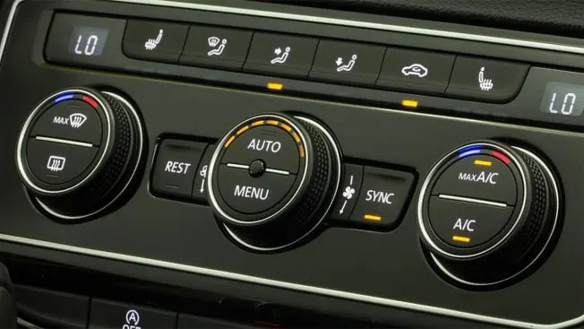

## Adjusting the AC in My Car

Derek Bergman - 14Dec2022

When I first got my car I found the AC controls to be frustrating as it does not match how other cars implemented the same features. Originally I wrote it off as Audi trying to be unique but upon taking a usability engineering course I better understand why this interaction is so frustrating. 

To clarify the buttons directly below the display are worn down, but they are -/+ buttons. 

When I was driving the car home for the first time, the temperature was already set to ‘LO’ and I just wanted to turn up the fan speed. My first instinct was to use the up arrow, I had never seen arrows on A/C controls but I wanted the fan to turn up so the up arrow made sense to me. I clicked up a few times and I only noticed the light was toggling on and off. I left it toggled on and the air was now blowing toward the windshield. I expected the windshield defrosters to be toggled by the button in the bottom left so the up arrow doing the same thing did not match my **mental model**. Turns out the fan speed is adjusted by using that worn out + button. 

Above is a picture of some other car A/C controls that matches my experiences with prior vehicles. I want to point out the little stick figures with arrows pointing to where the fans will blow. In my opinion, these make more sense as they follow the **conventions** followed across many cars and the figure clearly describes what is happening. While in my car the up/down arrow and whatever that symbol is between them control the fan output location. 

Now let’s explore how to set the temperature. I expected to use the big knobs on either side which is similar to what I’ve seen with other controls. Where these frustrate me is they have to be clicked to the left/right to adjust the temperature up/down and it is painfully slow. Usually these knobs twist and allow for the temperature to quickly go across the range. 
